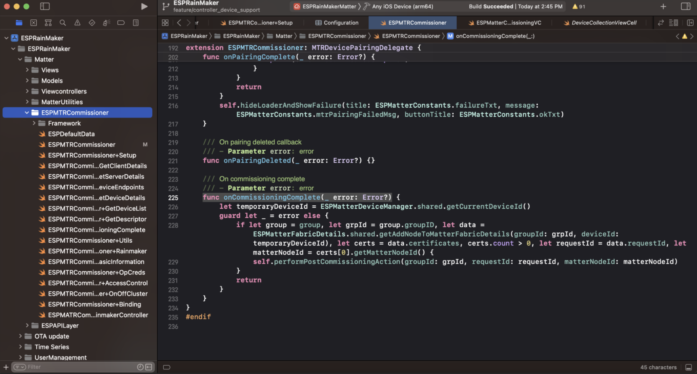
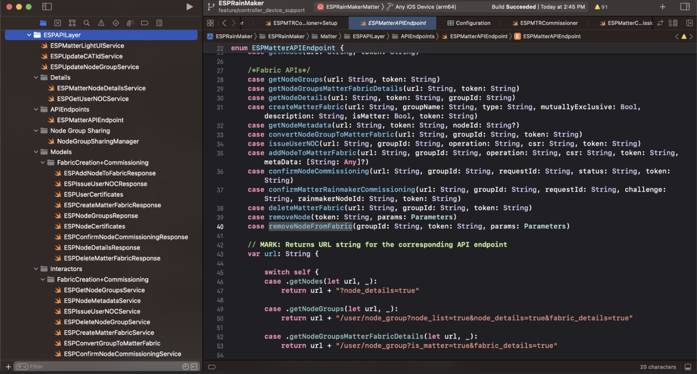
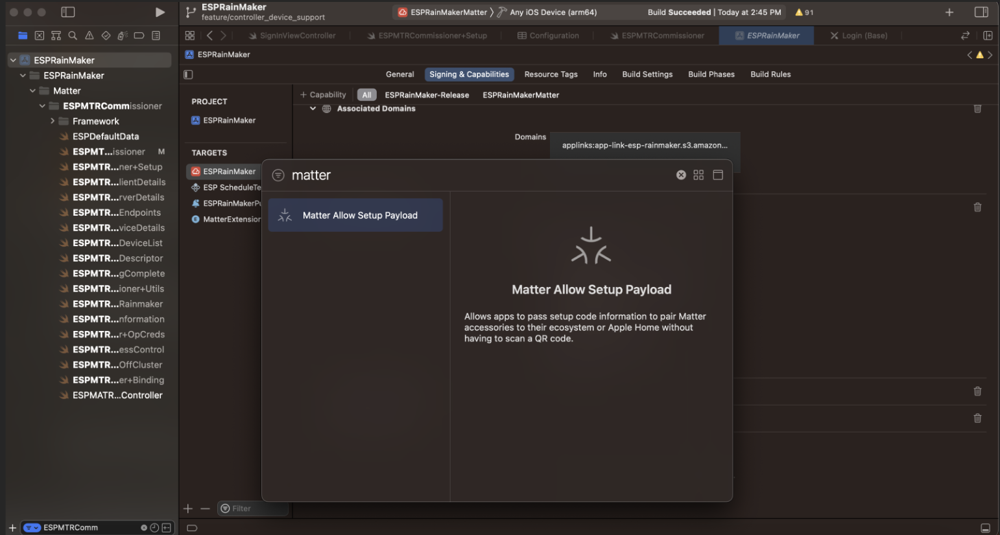
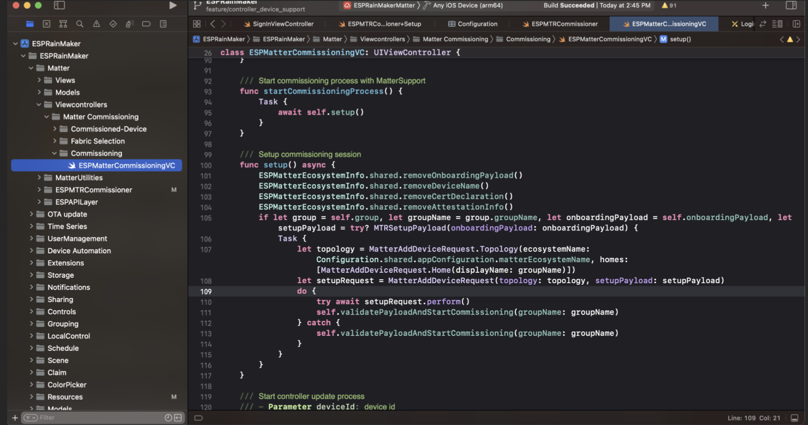
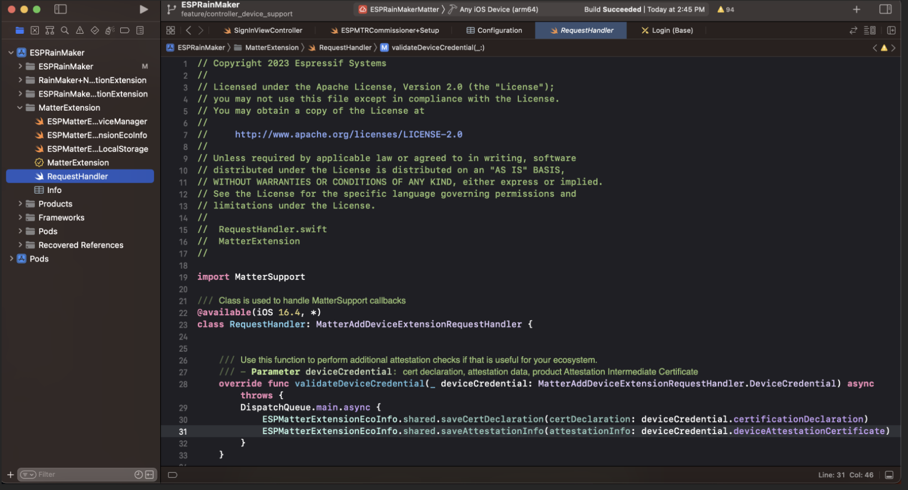

## Matter API Reference

Most of the matter related code in the repository is present in the Matter directory in the following location: **esp-rainmaker-ios/ESPRainMaker/ESPRainMaker/Matter**.


Some of the important classes used in the app: 

- *ESPMTRCommissioner*:



	This class is used to handle most of the matter operations including the following: 
	- Commissioning
	- On off cluster control 
	- Level control 
	- Open commissioning window 

	Files included: 
	ESPMTRCommissioner.swift contains API for the following: 
	- Start commissioning 
	- Device attestation callback
	- Issue node NOC

	ESPMTRCommissioner+Setup.swift contains API for the following: 
	- Initialize matter controller 
	- Shut down controller 
	- Commissioning establishment done 
	- Commissioning complete 

	ESPMTRCommissioner+GetClientDetails.swift: 
	- Get all client details from device cluster info 

	ESPMTRCommissioner+GetServerDetails.swift 
	- Get all server details from device cluster info 

	ESPMTRCommissioner+GetAllDeviceEndpoints.swift 
	- Get all device endpoints 

	ESPMTRCommissioner+GetDeviceDetails.swift: 
	- Add cat id operate to device access control list 

	ESPMTRCommissioner+GetDeviceList.swift 
	- Get device type list 

	ESPMTRCommissioner+GetDescriptor.swift 
	- Get descriptor cluster 

	ESPMTRCommissioner+CommissioningComplete.swift 
	- Perform post commissioning action 
	- Confirm  matter only node commissioning 
	- Confirm matter + rainmaker node commissioning 

	ESPMTRCommissioner+Utils.swift 
	- Is device connected via local network 
	- Get device metadata 

	ESPMTRCommissioner+Rainmaker.swift: 
	- Fetch rainmaker node id 
	- Send matter node id 
	- Read attribute challenge 

	ESPMTRCommissioner+BasicInformation.swift: 
	- Get basic information cluster 
	- Get vendor id 
	- Get product id 
	- Get software version

	ESPMTRCommissioner+OpCreds.swift:
	- Get op creds cluster 
	- Read current fabric index 
	- Remove fabric at index 

	ESPMTRCommissioner+AccessControl.swift: 
	- Read ACL attributes 
	- Write ACL attributes 

	ESPMTRCommissioner+OnOffCluster.swift: 
	- Get on off cluster 
	- Send Toggle command 
	- Send On command 
	- Send off command 

	ESPMTRCommissioner+Binding.swift: 
	- Bind devices 
	- Unbind devices 

	ESPMATRCommissioner+RainmakerController.swift: 
	- Get rainmaker controller cluster 
	- Read attribute refresh token 
	- Read attribute accesstoken 
	- Read attribute authorized 
	- Read attribute is User NOC installed 
	- Read attribute endpoint URL 
	- Read attribute rainmaker group id 
	- Append refresh token 
	- Reset refresh token 
	- Authorize 
	- Update user noc 
	- Update device list 

- *ESPAPILayer*:



	- ESPGetNodeGroupsService: Get node groups with matter fabric details
	- ESPCreateMatterFabricService: Create matter fabric
	- ESPNodeMetadataService: Get nodes metadata
	- ESPConvertGroupToMatterFabric: Convert node group to matter farbic
	- ESPIssueUserNOCService: Issue user NOC
	- ESPAddNodeToMatterFabricService: Add node to matter fabric
	- ESPConfirmNodeCommissioningService: Confirm node commissioning
	- ESPDeleteNodeGroupService: Remove matter fabric

### MatterSupport

Before commissioning the device to custom fabric, we will have to commission it to Apple's fabric using the MatterSupport app extension.

- Adding the Matter app extension. For commissioning we need to add Matter app extension. Follow the given steps on Xcode: 
	- Go to File -> New -> Target
	- Search for Matter and select the option

	- Go to app Signing and Capabilities section
	- Select + Capability option
	- Select Matter Allow Setup Payload option 

- Invoking MatterSupport workflow:
	- Go to file ESPMatterCommissioningVC.swift **(esp-rainmaker-ios/ESPRainMaker/ESPRainMaker/Matter/Viewcontrollers/Matter\ Commissioning/Commissioning/ESPMatterCommissioningVC.swift)**
	- The method **func startCommissioningProcess()** is invoked to start commissioning to Apple’s ecosystem.

- MatterSupport commissioning workflow:
	- Go to following file RequestHandler.swift **(esp-rainmaker-ios/ESPRainMaker/MatterExtension/RequestHandler.swift)**

	- This file contains the various callback methods that are invoked when device is being commissioned to Apple’s ecosystem. The callbacks are the following:
		- This method is used to perform attestation checks: **override func validateDeviceCredential(_ deviceCredential: MatterAddDeviceExtensionRequestHandler.DeviceCredential) async throws**
		- This method is used to select wifi network for the device: **override func selectWiFiNetwork(from wifiScanResults: [MatterAddDeviceExtensionRequestHandler.WiFiScanResult]) async throws -> MatterAddDeviceExtensionRequestHandler.WiFiNetworkAssociation**
		- This method is used to select threadnetwork for the device: **override func selectThreadNetwork(from threadScanResults: [MatterAddDeviceExtensionRequestHandler.ThreadScanResult]) async throws -> MatterAddDeviceExtensionRequestHandler.ThreadNetworkAssociation**
		- Commission device callback: **override func commissionDevice(in home: MatterAddDeviceRequest.Home?, onboardingPayload: String, commissioningID: UUID) async throws**
		- This method is used to return array of rooms managed by the ecosystem: **override func rooms(in home: MatterAddDeviceRequest.Home?) async -> [MatterAddDeviceRequest.Room]**
		- This method is used to configure device name: **override func configureDevice(named name: String, in room: MatterAddDeviceRequest.Room?) async**

  
### Matter Commissioning to custom Matter Fabric

- Initialize Matter controller: Controller is initialized using the following method: 

**func initializeMTRControllerWithUserNOC(matterFabricData: ESPNodeGroup, userNOCData: ESPIssueUserNOCResponse)**
file: **esp-rainmaker-ios/ESPRainMaker/ESPRainMaker/Matter/ESPMTRCommissioner/ESPMTRCommissioner+Setup.swift**

- Start commissioning process using the following method: 

**func startCommissioning()**
file: **esp-rainmaker-ios/ESPRainMaker/ESPRainMaker/Matter/Viewcontrollers/Matter\ Commissioning/Commissioning/ESPMatterCommissioningVC.swift**

- Once commissioning session establishment is done, we get a callback in the following method:

**func controller(_ : MTRDeviceController, commissioningSessionEstablishmentDone error: Error?)**
file: **esp-rainmaker-ios/ESPRainMaker/ESPRainMaker/Matter/ESPMTRCommissioner/ESPMTRCommissioner+Setup.swift**
We also call **MTRDeviceController->commissionNode(withID: NSNumber(value: deviceId), commissioningParams: params)** from this method to continue commissioning process.

- Next step is attestation verification. We get the callbacks in the following methods:

**func deviceAttestationCompleted(for controller: MTRDeviceController, opaqueDeviceHandle: UnsafeMutableRawPointer, attestationDeviceInfo: MTRDeviceAttestationDeviceInfo, error: Error?)**, when attestation succeeds.
file: **esp-rainmaker-ios/ESPRainMaker/ESPRainMaker/Matter/ESPMTRCommissioner/ESPMTRCommissioner.swift**

**func deviceAttestationCompleted(for controller: MTRDeviceController, opaqueDeviceHandle: UnsafeMutableRawPointer, attestationDeviceInfo: MTRDeviceAttestationDeviceInfo, error: Error?)**, when attestation fails.
file: **esp-rainmaker-ios/ESPRainMaker/ESPRainMaker/Matter/ESPMTRCommissioner/ESPMTRCommissioner.swift**

- We call the **MTRDeviceController->continueCommissioningDevice** from either of the above callbacks to continue the commissioning process.

file: **esp-rainmaker-ios/ESPRainMaker/ESPRainMaker/Matter/ESPMTRCommissioner/ESPMTRCommissioner.swift**

- Next we get CSR from the device and then use that to get node NOC, in the following callback: 

**func issueOperationalCertificate(forRequest csrInfo: MTROperationalCSRInfo, attestationInfo: MTRDeviceAttestationInfo, controller: MTRDeviceController, completion: @escaping (MTROperationalCertificateChain?, Error?) -> Void)**
file: **esp-rainmaker- ios/ESPRainMaker/ESPRainMaker/Matter/ESPMTRCommissioner/ESPMTRCommissioner.swift**

- Fetch Node NOC from device CSR:

Following code is used to fetch node NOC from device CSR:

```
let nodeGroupURL = Configuration.shared.awsConfiguration.baseURL + "/" + Constants.apiVersion 
let service = ESPAddNodeToMatterFabricService(presenter: self) 
let finalCSR = "-----BEGIN CERTIFICATE REQUEST-----\n\(csrString)\n-----END CERTIFICATE REQUEST-----"                 
if let metadata = metadata, metadata.count > 0 { 
	service.addNodeToMatterFabric(url: nodeGroupURL, groupId: groupId, operation: "add", csr: finalCSR, metadata: metadata) 
} else { 
	service.addNodeToMatterFabric(url: nodeGroupURL, groupId: groupId, operation: "add", csr: finalCSR, metadata: nil) 
}
```
file: **esp-rainmaker- ios/ESPRainMaker/ESPRainMaker/Matter/ESPMTRCommissioner/ESPMTRCommissioner.swift**

- We get the NOC in the following callback: 

**func nodeNOCReceived(groupId: String, response: ESPAddNodeToFabricResponse?, error: Error?)**
file: **esp-rainmaker- ios/ESPRainMaker/ESPRainMaker/Matter/ESPMTRCommissioner/ESPMTRCommissioner.swift**

- Node NOC received in the previous callback is sent to device using a completion handler received in the issueOperationalCertificate callback. 

- Once commissioning is complete we get the callback in the following method: 

**func controller(_ controller: MTRDeviceController, commissioningComplete error: Error?)**
file: **esp-rainmaker- ios/ESPRainMaker/ESPRainMaker/Matter/ESPMTRCommissioner/ESPMTRCommissioner+Setup.swift**